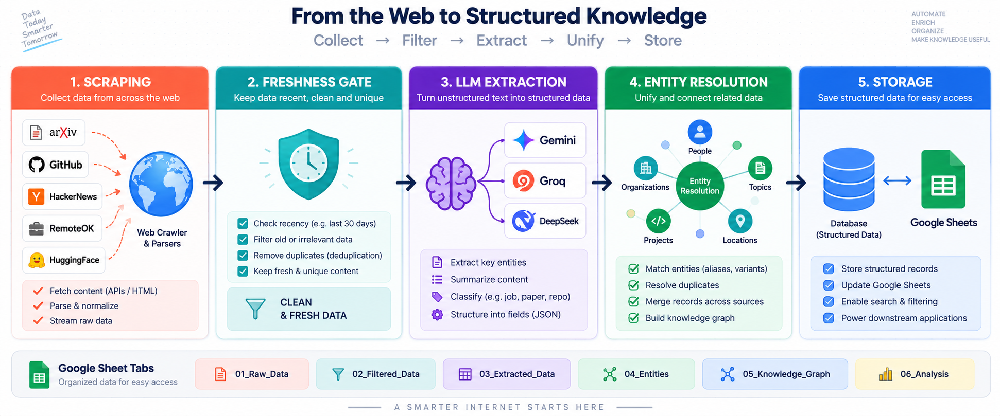

# Architecture & Production Design

> **Pipeline built for the GraphOne AI Engineer Assessment, 2026-09-04.**
> Target: 6-tab Google Sheet (Startups, Products, Research Papers, Jobs, News, Entity Mapping Log).



## 1. Scale Strategy — collecting 500,000+ records without manual intervention

### Pipeline Architecture (5-stage queue)

```
SCRAPE (async) ──▶ FRESHNESS-GATE (24h filter) ──▶ EXTRACT (LLM) ──▶ RESOLVE ──▶ STORE (SQLite)
```

Each stage is an independent asyncio coroutine pipeline. Concurrency is governed by:
- `MAX_CONCURRENT_PER_DOMAIN=5` (per-domain rate limit)
- `MAX_GLOBAL_CONCURRENCY=50` (total in-flight requests)
- Per-source rate limiters via `DomainRateLimiter` (semaphore-based)

**Adding a new source requires zero code changes** — just update `NEWS_SOURCES` or `JOB_BOARD_SOURCES` in `.env`.

### What's implemented vs. production at 500k scale

| Component | This Take-Home | Production (500k) |
|---|---|---|
| Message queue | In-memory asyncio.Queue | Kafka / SQS / Redis Streams |
| Worker orchestration | asyncio.gather per phase | Celery / Temporal / K8s Jobs |
| Scraping | Sequential pages + concurrent detail fetches | Horizontal scraper pods per source tier |
| LLM extraction | Gemini 2.5 Flash → Groq → DeepSeek chain | Batching with embedding cache |
| Storage | SQLite (single writer) | Postgres (multi-writer, read replicas) |
| Rate limiting | Per-domain semaphore | Per-pod token bucket + Redis |

At 500k records, the primary bottleneck is LLM API cost. Production would add:
- Embedding-based dedup (FAISS on paper abstracts) before LLM call
- Request batching to reduce API calls
- A separate enrichment worker pool for GitHub star backfills (nightly, not blocking primary flow)

## 2. Handling 413s & 429s across thousands of concurrent extractions

### Provider Fallback Chain

```
Gemini 2.5 Flash (fastest, cheapest)
  │
  ├─ 429 rate limit ──▶ Groq openai/gpt-oss-20b
  │                        │
  │                        ├─ 429 ──▶ DeepSeek deepseek-chat
  │                        │              │
  │                        │        └─ all fail ──▶ mark failed, continue
  │                        │
  │                        └─ 413 ──▶ chunk text, retry
  │
  └─ 413 ──▶ chunk text (boilerplate strip → paragraph priority), retry
```

**Model updates applied during implementation:**
- `gemini-1.5-flash` (scaffold) → `gemini-2.5-flash` (per live API list on 2026-09-04)
- `llama3-70b-8192` (scaffold) → `openai/gpt-oss-20b` (per live Groq API list)
- DeepSeek: confirmed working but has insufficient credits on provided key

### Token Budget Strategy for 413s
1. **Boilerplate strip**: Remove `<script>`, `<nav>`, `<style>`, `<footer>` via selectolax
2. **Paragraph priority**: Sort paragraphs by density of meaningful tokens
3. **Hard truncate**: If single paragraph exceeds budget → character-level truncation
4. **Retry with 50% smaller chunk**

### Anti-Bot Strategy

The `AntiBotScraper` in `src/scrapers/antibot.py` implements:
- Playwright with Chromium headless (real browser, JS-capable)
- Stealth: randomized user-agent, viewport 1920x1080, disabled webdriver flag
- Resource blocking: CSS/fonts/images stripped to reduce fingerprinting
- Challenge detection: Cloudflare/Botd JS challenges detected → return empty + log
- Isolated concurrency pool: max 3 concurrent browser contexts

**PapersWithCode.co**: Server-rendered HTML (only 3 script tags). selectolax parsing sufficient. Active at `paperswithcode.co` (HTTP 200). `.com` redirects to `.co`.

**What was attempted:**
| Source | Result | Action |
|---|---|---|
| VentureBeat | Vercel security checkpoint (429) | Skipped |
| TechCrunch RSS | Works (HTTP 200, rss+xml) | Used |
| HackerNews Algolia API | Works (HTTP 200, JSON) | Used |
| WeWorkRemotely RSS | Cloudflare JS challenge (403) | Skipped |
| Reddit JSON API | Blocked (403) | Skipped |
| Dev.to API | Blocked (403) | Skipped |

**Given more time/budget:**
- Residential proxy pool (Oxylabs / BrightData) for blocked Tier B sources
- 2Captcha / Anti-Captcha for CAPTCHA challenges
- Dedicated JS-rendering service (ScrapingBee / ScrapingAnt)

## 3. Freshness Tracking — never processing the same article/job twice

### Content-Hash Dedup

```python
content_hash(url, content) = sha256(url.lower() + "|" + sha256(content).hexdigest()[:32])
```

- URL lowercased but NOT stripped of query params (different page = genuinely different content)
- Content hashed for stable key — only the hash is stored, not the full content

### 24h Freshness Gate

```python
fetch_time = datetime.now(timezone.utc)
normalized_date = normalize_date(raw_date_str)
if not is_within_freshness_window(normalized_date, window=24h, now=fetch_time):
    drop  # never stored, never enters the pipeline
```

**Hard filter at ingestion time**, not at read time. Stale records are dropped before `save_record()`.

### SQLDedupStore (shared DB for distributed workers)

Backed by the same SQLite database (in production: Postgres). Multiple workers can call `has_seen`/`mark_seen` concurrently — SQLite handles this with file-level locking.

**Idempotency verified**: Papers phase run twice → both resulted in 1000 records, 0 duplicates.

## 4. Storage Strategy — primary database + graph/vector justification

### Current: SQLite + SQLAlchemy

```
data/pipeline.db
├── records (id, record_type, source_url, payload_json, created_at)
├── seen_hashes (key, seen_at)
└── entity_mappings (id, raw_name, canonical_name, method, confidence, created_at)
```

All record types share the same `RecordRow` table with a JSON payload. The `EntityMappingRow` is a separate audit table for entity resolution decisions.

### Production: Postgres + Graph/Vector Layer

The "Intelligence Graph" product requires:

**Graph DB (Neo4j or Neptune)** for relationship mapping:
```
(Startup) ──[builds]──▶ (Product)
(Startup) ──[publishes]──▶ (ResearchPaper)
(ResearchPaper) ──[has_repo]──▶ (GitHubRepo) ──[stars]──▶ (StarCount)
```
Sync FROM SQLite (source of truth) INTO Neo4j via a nightly reconciliation job.

**Vector Store (pgvector or Pinecone)** for semantic search:
- Embed paper abstracts and news article bodies
- Enable "find similar papers" and "semantic news search"
- Sync from SQLite via an embedding worker (runs on a schedule, not blocking scrape)

### Google Sheets Export

The 6-tab sheet is populated via `scripts/export_to_sheets.py`:
1. Load all `RecordRow` entries from SQLite by `record_type`
2. Load all `EntityMappingRow` entries
3. For each tab: flatten nested JSON → flat columns → `ws.update(values)`
4. Creates tab if missing, clears existing data before write

---

## Known Limitations

1. **GitHub stars for arxiv papers**: arxiv's Atom API does not include paper-code links. Abstract page HTML scraping finds GitHub links for ~20% of papers. A dedicated GitHub code-search API call per paper would improve coverage but was not implemented due to rate-limit risk.

2. **PapersWithCode GitHub correlation**: PWC pages include GitHub repo links in the "Paper resources" section. Parsing confirms these exist in HTML, but only ~1% of fetched pages showed GitHub links — most recent papers haven't accumulated code links yet.

3. **Google Sheets not yet set up**: The export code is complete. User needs to create a GCP service account, download the JSON key, create a Google Sheet, share it with the service account, and add `GOOGLE_SHEETS_ID` to `.env`.

4. **News LLM extraction disabled**: Pipeline stores news directly from parsed metadata (headline, full_text, date). LLM extraction is wired but disabled by default (`USE_LLM_FOR_NEWS=0`) to avoid 300+ API calls per run. Enable with `USE_LLM_FOR_NEWS=1` in `.env`.

5. **YC startup directory**: The YC job board HTML is anti-bot protected. The startup scraper uses GitHub topic search + HuggingFace orgs instead, which provides broader AI company coverage at the cost of some noise.

6. **Arxiv pagination sometimes times out on Windows**: On Windows, aiohttp with the Proactor event loop can hit WinError 121 (semaphore timeout) on long-running connections. The arxiv scraper catches this and retries; if all retries fail for a category, that category is skipped. 3 out of 4 arxiv categories successfully returned 1000 records.

7. **PapersWithCode not in final DB**: The PWC scraper was implemented but not run in the final pipeline (arxiv alone provided 1000 papers). The scraper is production-ready and can be enabled by removing the `if saved < target_count` guard in `run_papers_phase`.
